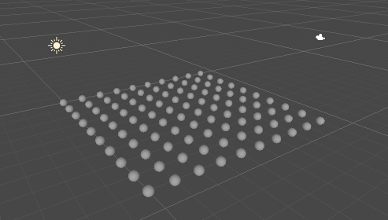
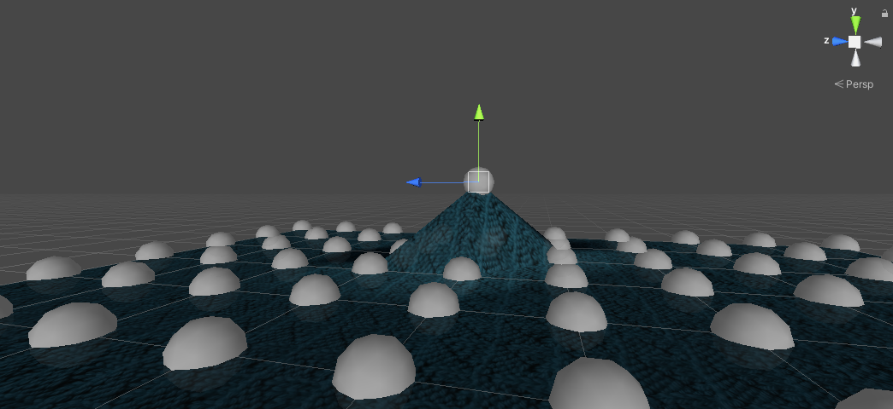

# Blog 26/2-21
## Mesh generation
### Grid of points
For our project we decided that we should simulate a piece of cloth with a mass spring system in a grid. So first we made some code to generate some unity **GameObject**s int a grid. We also added some **Gizmos** to show where the points where.

### Mesh
We then wrote some code to generate a mesh between theese points. We also tied the vertex coordinates in the mesh to the points so the mesh could be deformed by moving the points. We also put on a texture to make it look nicer.

