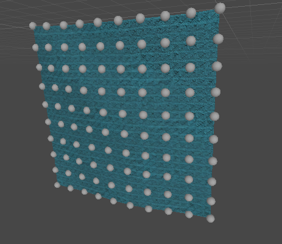

# Blog 1/3-21
## Forces on the mass spring system.
### What's the deal with cloth?
We found a labb instruction from the University of California where they explained how to connect the nodes in the mass spring system with springs. [Link to the labb](https://www.ics.uci.edu/~shz/courses/cs114/docs/proj3/index.html). The springs in the system were of 3 kinds. One that went to the horizontal and vertical neighbours, one that went to diagonal neighbours and lastly one that went two over horizontally and vertically. We then used that as a basis to implement the mass spring system with a kind of forward Euler method. We just updated the forces on the nodes in **FixedUpdate** and scaled them with the **FixedUpdate** time step. This produced a simulation! However as in the rope lab the stiffness of the springs could not be so high without the system going bananas so later we will move to the RK4 method.
