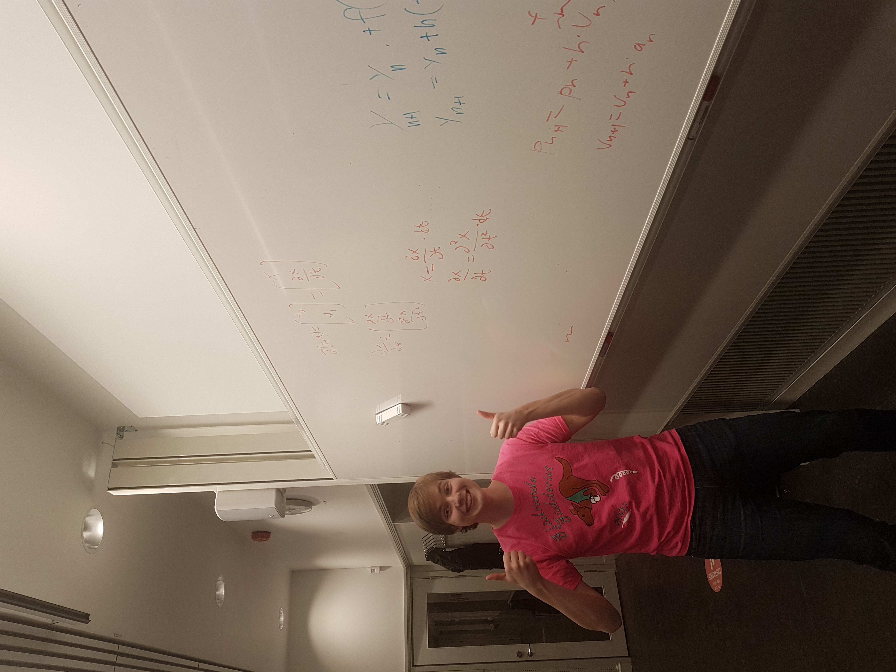

# Blog 3/3-21
## RK4
### System of first order ODE
Our first problem with the RK4 method is that it is for solving first order differential equiations. However ours is a second order since it involves acceleration. To solve this we had to rewrite our second order ODE as a system of two first order ODE. We did this in a previous course but we had to refresh our memory. Here is an image where we try to figure this out on a white board:

### RK4
After we had firguered out how to do it. We moved on to implement this in code. It took some time and we mixed upp which variable where which in the ODE system which led to some bugs but in the end we came upp with something that worked. The final result looked a lot like before but now we could have a much higher stiffness in the springs.