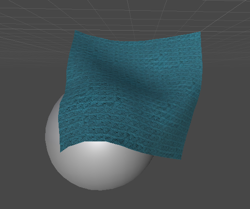

# Blog 6/3-21
## Sphere Collision
### Our own idéa
In our first attempt to implement collision we thought up an idéa to implement the normal force when a grid point is inside a sphere. And then add that force in our RK4 implementatiom. This did not work well. The result was bananas.

### Someone elses implementation
We then found someone else who had implemented cloth collision to a sphere. And copied their idea. This idea was to when a point is about to move inside the sphere we insted project the point to the sphere. This is done by first normalising the difference between the sphere center and the point we are moving to and then scaling that with the sphere radius. When we had implemented this the results where much better as can be seen in the image.
